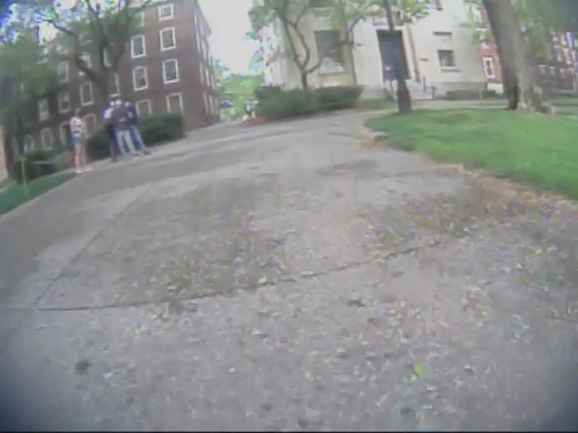
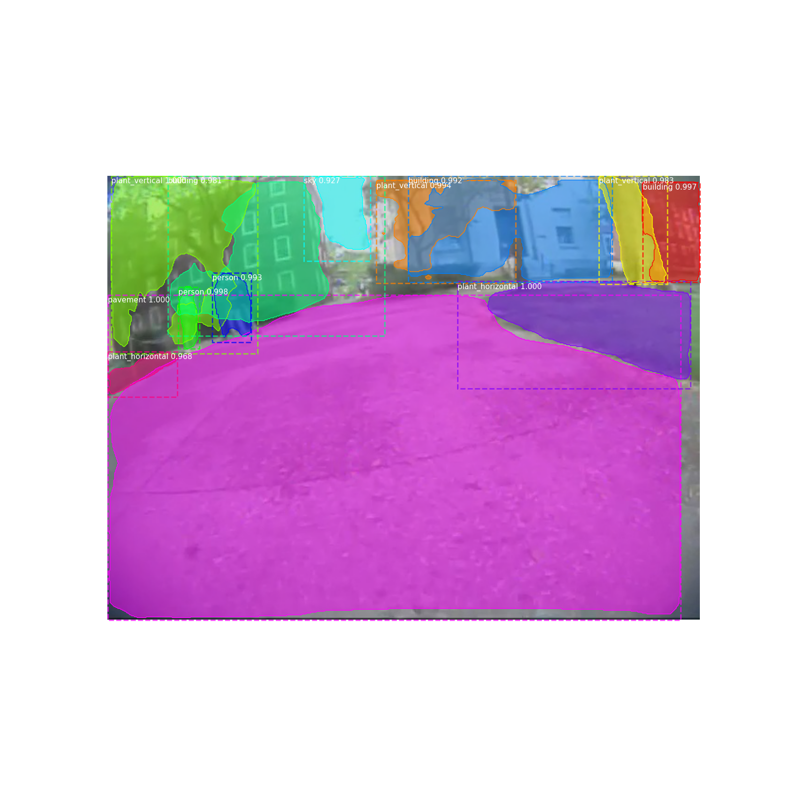
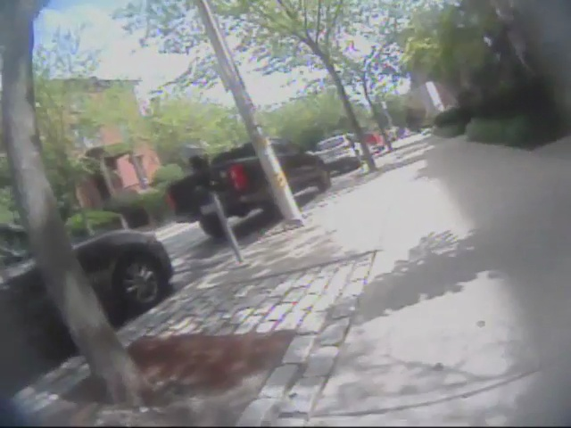
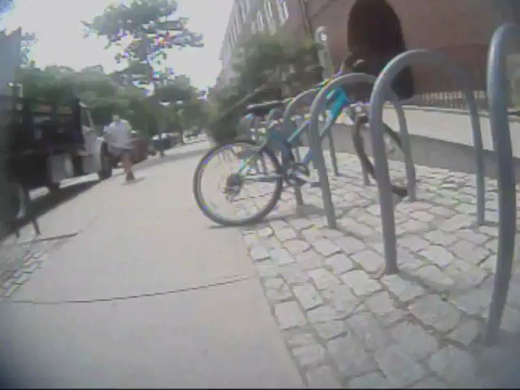
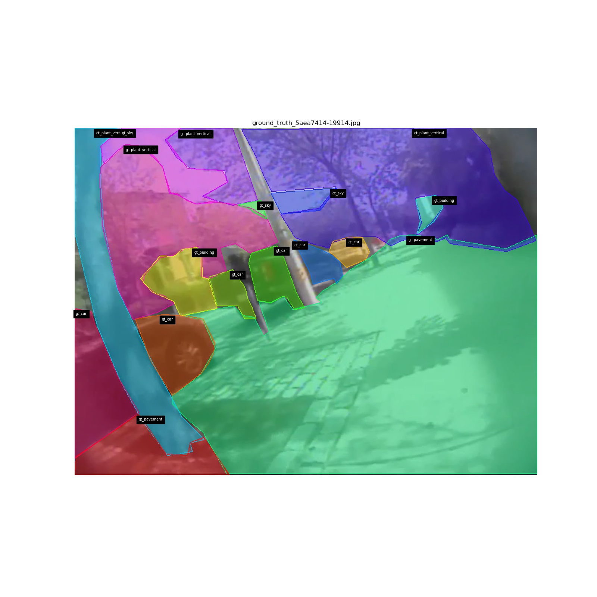
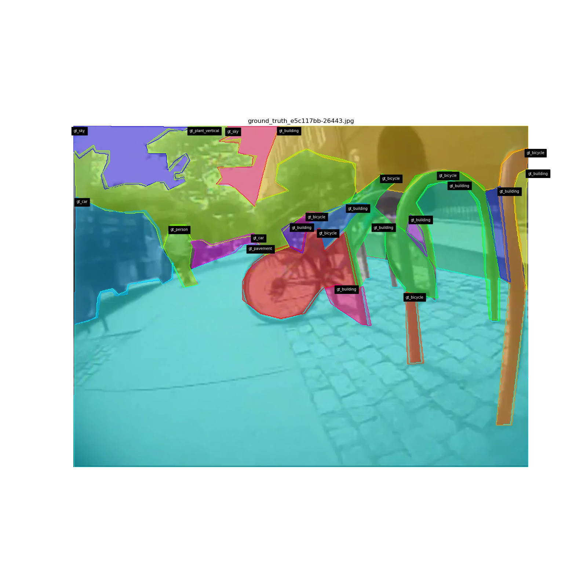
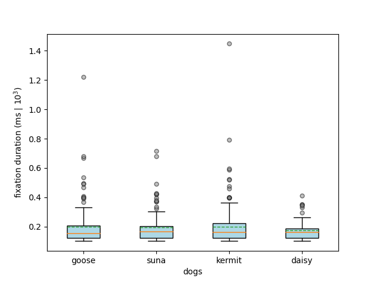
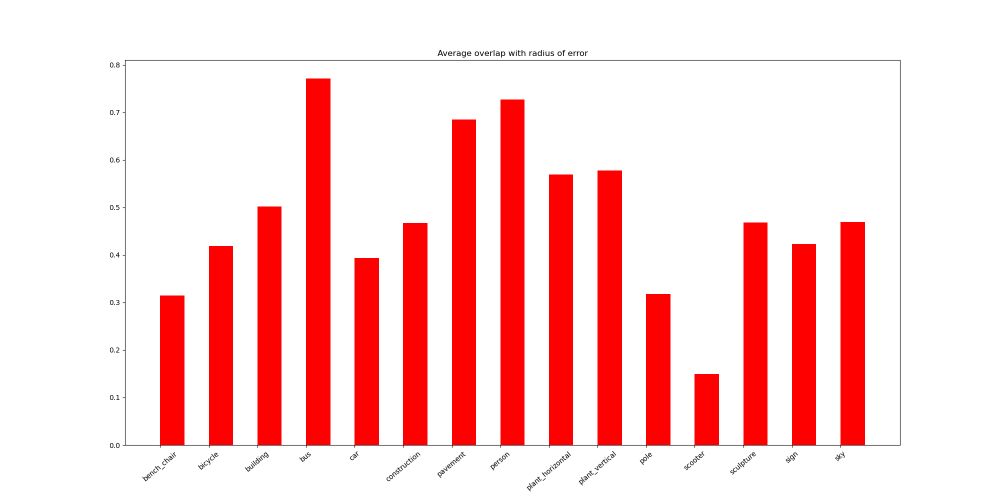
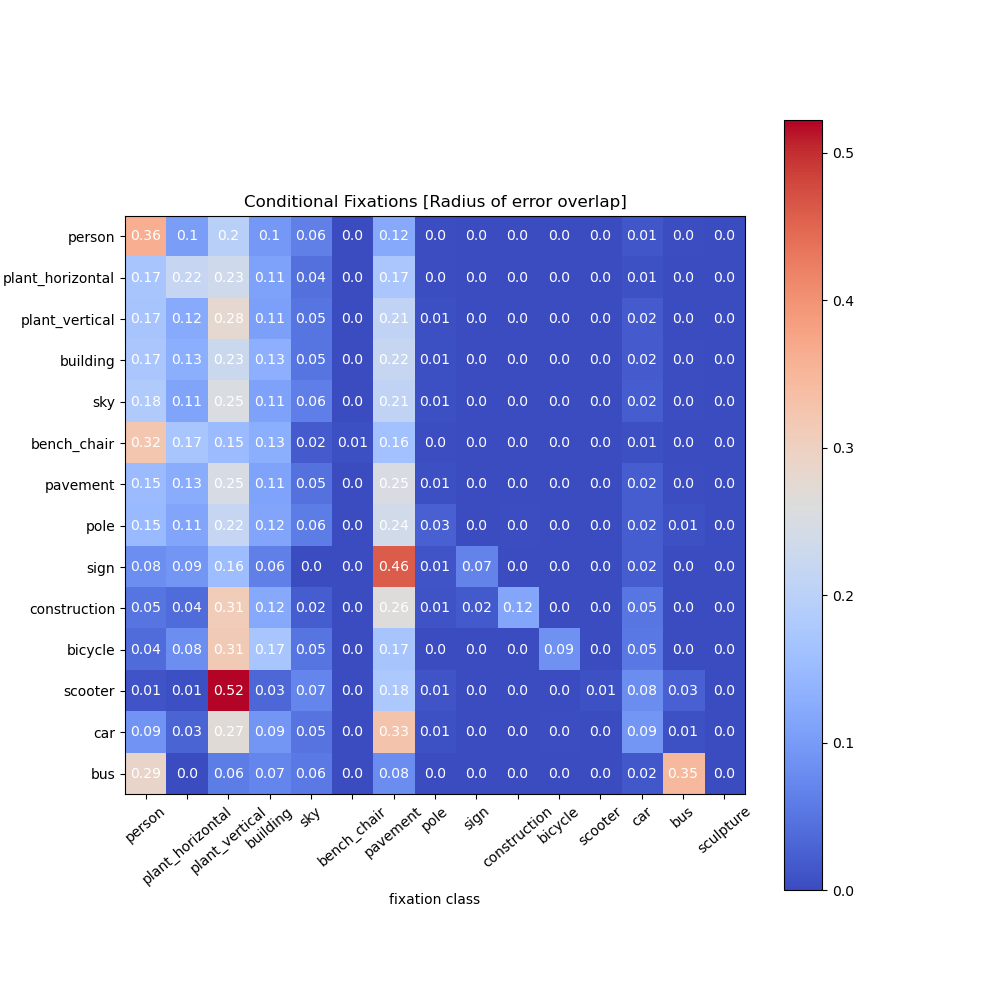

# Dog Vision: Using object-detection to track visual behavior patterns in dogs

This project utilizes the [Mask RCNN](https://arxiv.org/abs/1703.06870) provided by [matterport](https://github.com/matterport/Mask_RCNN) (on Python3, Keras and Tensorflow) to perform scene segmentation and object detection on images captured by a calibrated eye-tracking camera fitted on dogs.




Our work aims to track the regions of "fixation" across captured scenes and analyze the frequency/types of objects that dogs fixate upon; thus leveraging computer vision to automate detection. For more details on methodology and results, please refer to our [paper](paper link)

# Project Overview

The repository is structured in the following way:
* `Mask_RCNN` contains the original matterport repository along with added scripts for custom dataset generation, model fine-tuning, evaluation and fixation prediction
* `Datasets` contains scripts to load additional images from the OpenImagesV6 dataset and parse video data into frames with fixations; `dog_video_dataset` contains the custom dataset of dog video frames used for training/validation + corresponding manual annotations for each frame
* `Metadata` contains scripts to parse the metadata information about each subset of each collected dataset (training/validation sets from OpenImagesV6, COCO or CityScapes) i.e. including class counts, instance counts, class distributions etc..
* `analytics` contains scripts that perform qualitative (on image samples) and high-level quantitative analysis on fixation patterns for each dog in the pilot study; the subfolders contain visualizations that provide a better idea of analytics performed
* `results` contains `scripts` to visualize predicted fixations (qualitatively/quantitatively) as well as compare to ground_truth annotations; the subset of `experiment_{}` folders also contain evaluation metrics + qualitative results (on image samples) from each experiment - to visualize/compare model performance
<!-- * `additional_resources` NOT NEEDED IN FINAL REPO -->

# Setting Up

The codebase is designed to be modular and extendable to other datasets and/or applications that may be of interest.

Before getting started, please familiarize yourself with the codebase structure and the [matterport Mask-RCNN](Mask_RCNN) repository. If you would like to better understand how Mask-RCNN technically works, consider reading the following articles [A](https://alittlepain833.medium.com/simple-understanding-of-mask-rcnn-134b5b330e95#:~:text=Mask%20RCNN%20is%20a%20deep,two%20stages%20of%20Mask%20RCNN) and [B](https://www.analyticsvidhya.com/blog/2019/07/computer-vision-implementing-mask-r-cnn-image-segmentation/)

## Requirements

```
Python 3.4 (or higher), Tensorflow 1.15.0 (or higher), Keras 2.0.8 (or higher) and other packages listed in `requirements.txt`
```

1. Follow the instructions to install [conda](https://docs.conda.io/projects/conda/en/latest/user-guide/install/) (version 4.10.3) and create a new conda environment using `conda create --name <env_name>`


2. To train or test on the MS COCO dataset, follow the "MS COCO Requirements" section provided in the matterport repository (attached below)

```
To train or test on MS COCO, you'll also need:
* pycocotools (installation instructions below)
* [MS COCO Dataset](http://cocodataset.org/#home)
* Download the 5K [minival](https://dl.dropboxusercontent.com/s/o43o90bna78omob/instances_minival2014.json.zip?dl=0)
  and the 35K [validation-minus-minival](https://dl.dropboxusercontent.com/s/s3tw5zcg7395368/instances_valminusminival2014.json.zip?dl=0)
  subsets. More details in the original [Faster R-CNN implementation](https://github.com/rbgirshick/py-faster-rcnn/blob/master/data/README.md).

If you use Docker, the code has been verified to work on
[this Docker container](https://hub.docker.com/r/waleedka/modern-deep-learning/).
```

Install `pycocotools` from one of these repos. They are forks of the original pycocotools with fixes for Python3 and Windows (the official repo doesn't seem to be active anymore).

    * Linux: https://github.com/waleedka/coco
    * Windows: https://github.com/philferriere/cocoapi.
    You must have the Visual C++ 2015 build tools on your path (see the repo for additional details)


3. For training, fine-tuning or larger scale inference using Mask-RCNN it is optimal to have access to a GPU setup

```
To setup and check compatibility between your GPU setup and TensorFlow, please check the following:

* [installing](https://www.tensorflow.org/install/pip) TensorFlow for GPU
* [verifying](https://www.tensorflow.org/guide/gpu) your GPU setup for TensorFlow
* (optional) guides for installing [NVIDIA drivers](https://docs.nvidia.com/datacenter/tesla/tesla-installation-notes/index.html) and [CUDA toolkit](https://docs.nvidia.com/cuda/cuda-quick-start-guide/index.html) for GPU setup
```

## Installation & Setup

1. Clone this repository
2. Follow the conda installation setup in step 1 of the section above
3. Install dependencies in `requirements.txt`. Note that the `requirements.txt` file also contains the necessary libraries to run the matterport Mask-RCNN repository
Run ```bash pip3 install -r requirements.txt```

4. Access the [Google Drive link](https://drive.google.com/drive/folders/1LlePbNRisWorv8ycHr1H-uwVirSKSbDO?usp=sharing) that contains the parsed datasets used (COCO, OpenImagesV6, CityScapes and custom video) and the model weights from our fine-tuned experiments

  * from `github_data/datasets` in Google Drive, copy the zip files for each dataset into the `dogvision-eyefixations/Datasets` folder within the repo
  * from `github_data/weights/experiment_<experiment number>` in Google Drive, copy the weight files (formatted as `epoch_<epoch no>_<date>_<time>.h5`) into their respective folders within the repo i.e. `dogvision-eyefixations/Mask_RCNN/mrcnn_pretrained_implementation/logs/experiment_<experiment number>/weights`
  * from `github_data/coco_default` in Google Drive, copy the `coco_weights.zip` file into `dogvision-eyefixations/Mask_RCNN/samples/coco` in the repo

5. Unzip the extracted dataset and weight files

# Training Pipeline

[mask_rcnn_dataset.py](Mask_RCNN/mrcnn_pretrained_implementation/mask_rcnn_dataset.py) and [dataset_configs.json](Mask_RCNN/mrcnn_pretrained_implementation/dataset_configs.json) are the primary scripts used for fine-tuning the Mask-RCNN model

1. Use `dataset_configs.json` to setup the datasets, sampling methods and any optional pre-processing augmentations to apply to the training data

2. Use the `TrainingConfig` class in `mask_rcnn_dataset.py` to setup experiment hyper-parameters for your experiment i.e. model backbone (`ResNet101` default), learning rate, number of epochs

3. Use the `CustomDataset` class in `mask_rcnn_dataset.py` to specify the target classes and loading the configured/pre-processed dataset using the `DatasetGenerator` class

4. Ensure to setup the correct `WEIGHTS_DIR` and `EXPERIMENT_NO` configs to access the right default weights + logdir upon starting the experiment

5. Run `python3 mask_rcnn_dataset.py` to run your new experiment. Track results within the `logs/experiment_<experiment number>` folder

# Evaluation + Prediction Pipelines

[mask_rcnn_evaluation.py](Mask_RCNN/mrcnn_pretrained_implementation/mask_rcnn_evaluation.py) and [mask_rcnn_prediction.py](Mask_RCNN/mrcnn_pretrained_implementation/mask_rcnn_prediction.py) are the primary scripts used for evaluating the fine-tuned models and generating fixation predictions

1. Run `python3 mask_rcnn_evaluation.py` to evaluate a fine-tuned/pre-trained model on the test dataset
* use the `InferenceConfig` class to setup hyper-parameters for evaluation e.g. number of GPUs, detection confidences etc...
* use the `--experiment` and `--weights_file` arguments to specify the experiment results to use for evaluation
* use `--num_classes` to specify the number of target classes for the given experiment of interest
* use `--default` to get baseline evaluation results using MS COCO weights and classes

Track evaluation outputs (a `metrics.csv` file and qualitative  samples) in the `evaluation_output/experiment_<experiment number>` folder

2. Run `python3 mask_rcnn_prediction.py` to generate fixation predictions from fine-tunes/pre-trained models on the dog camera data

Fixation prediction uses the area of overlap with a "radius of error" around the recorded point of fixation to generate a probability distribution of possible fixated objects

* use the `InferenceConfig` class to setup hyper-parameters for evaluation e.g. number of GPUs, detection confidences etc...
* use the `--experiment` and `--weights_file` arguments to specify the experiment results to use for evaluation
* use `--num_classes` to specify the number of target classes for the given experiment of interest
* use `--default` to get baseline evaluation results using MS COCO weights and classes
* use `--ground_truth` to get fixation predictions using ground-truth annotations of images
* use `--dog_name` to specify the subset of images to generate fixation predictions for
* use the `--save_fail` flag to save the subset of examples where no fixation prediction is made i.e. saving error cases

Track fixation prediction outputs (`<dog name>.csv` file) in the `fixation_prediction/experiment_<experiment number>` folder

3. To produce additional visualizations + ground truth comparisons based on fixation predictions, copy the output `metrics.csv`, qualitative samples and `<dog name>.csv` (fixation predictions) to the [results](`results`) folder following the existing format

```
--results
  |
  |-> experiment_<experiment number>
  |
  |----> metrics.csv
         sample_{i}.png
         experiment_<experiment_number>
         |
         |--> ... fixation prediction data...
  ....
  |
   -> scripts

```

# Datasets

Our work makes use of a variety of large existing image databases as well as a custom dataset of images captured by eye-tracking cameras mounted on the dogs being tested

## External Datasets

We utilize subsets of popular datasets including [MS COCO](https://cocodataset.org/#home), [OpenImagesV6](https://storage.googleapis.com/openimages/web/index.html) and [CtiyScapes](https://www.cityscapes-dataset.com/dataset-overview/#class-definitions). The subset of data used (pertaining to objects of interest in our study) are contained on the [Google Drive](https://drive.google.com/drive/folders/1LlePbNRisWorv8ycHr1H-uwVirSKSbDO?usp=sharing) repository

To source additional data from the OIV6 dataset, please use the [open_images_v6_dataset_loader.py](Datasets/open_images_v6_dataset_loader.py) script to pull new data pertaining to specific objects/classes of interest.

## Custom Dataset

We also curated a custom dataset of 1233 frames captured by eye-tracking cameras mounted on the dogs used in the study; these have already been split intro training/validation sets within the [split_dataset.csv](Datasets/dog_video_dataset/split_dataset.csv) file

Each image has been manually annotated using polygon annotations (see below)



# Results

An overview of our most interesting findings (averaged across all dogs) are visually presented below. For a more expansive exploration and thorough analysis of results, for each individual dog in the study, please refer to the [associated work](paper link)





Use the [scripts](results/scripts) provided to compare fixation predictions with ground truth and generate additional visualization of results

## Future Ideas

This project will continue to develop and grow. Here are some features we plan to implement in the near future:
* implement object detection and segmentation on live video
* expand the existing dataset using video footage from new dogs
* fine-tune models on new sets of objects + refine model performance

# Contributing

Our team welcomes contributions to this repository and project; you can also join our team. For further correspondence, please reach out to the authors of the [associated work](paper link)

# FAQs

Any FAQs and common issues will be updated in this section!
